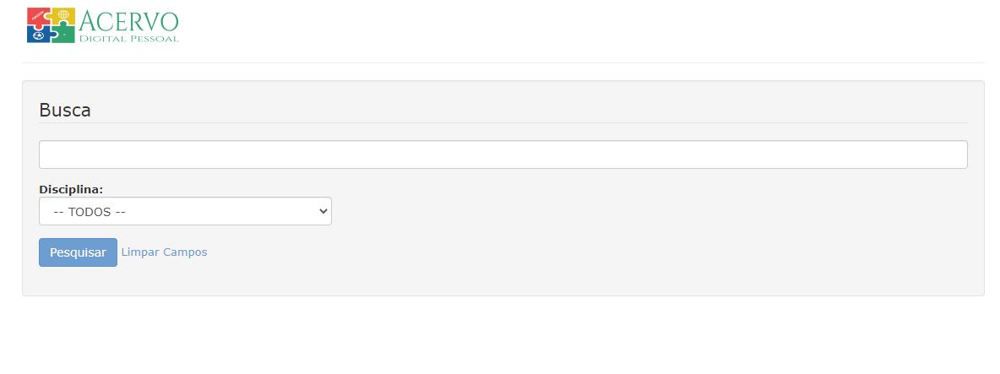

# Acervo-Digital-Pessoal
Simple document search.

Below screen shot:



## Getting Started

### 1. MySql Database

create a database and tables on your mysql server, the sql script is located on /sql/acervo digital pessoal.sql

### 2. Clone the repository on your webserver

```
$ cd /var/www/
$ git clone https://github.com/domwal/acervo-digital-pessoal.git
```

### 3. Set Folders Permission

```bash
$ chmod 777 files
$ chmod 777 admin/tmp
```

### 4. Test if is all ok

Open your browser and open the url: http://127.0.0.1/acervo-digital-pessoal/test.php

If show text: ---- OK ----

Fine. All is ok.

### 5. Admin Default Password

user: admin

pass: admin

### 7. Open browser

Go to <http://127.0.0.1/acervo-digital-pessoal>

or Administration

Go to <http://127.0.0.1/acervo-digital-pessoal/admin>
